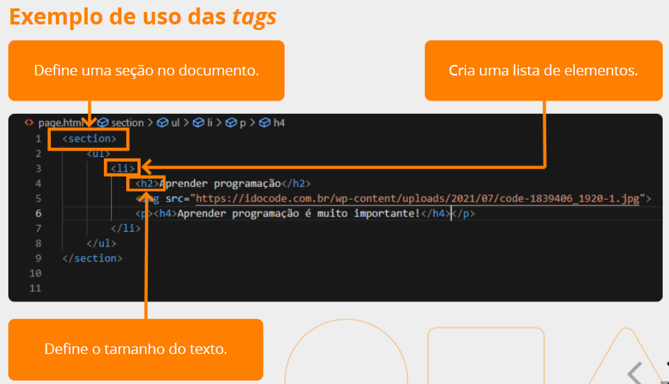
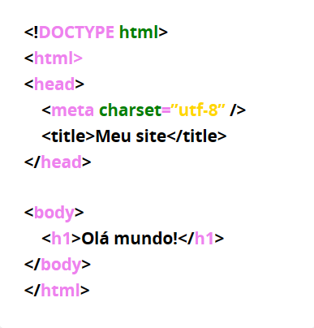

# O conteúdo deste documento

- [O conteúdo deste documento](#o-conteúdo-deste-documento)
  - [Raciocínio lógico](#raciocínio-lógico)
  - [Lógica imperativa](#lógica-imperativa)
  - [Introdução à Programação](#introdução-à-programação)
  - [HTML](#html)
    - [Layout do site](#layout-do-site)

## Raciocínio lógico

- Estrutura o pensamento baseado em normas da lógica para chegar a uma conclusão.

[Voltar ao repositório principal](/README.md)

[Voltar ao índice](#o-conteúdo-deste-documento)

## Lógica imperativa

- Lógica
  - Entende-se como a **correção do pensamento**, uma maneira de colocar a mente em ordem
  - Ela pode ser informal, formal, simbólica, matemática, e,
  - **Lógica de programação: resolver problemas através de software ou aplicação**
    - Baseado em princípios da lógica
    - É a criação de algoritmos, uma forma encadeada de pensar
    - Para implementá-la utilizando algoritmos, é necessário uma sequência de instruções
    - Por exemplo, para trocar uma lâmpada queimada precisamos seguir uma sequência de passos

- Pensamento computacional
  - Fundamentado em **quatro pilares**:
    - decomposição
    - reconhecimento de padrões
    - abstração
    - pensamento algorítmico

- Algoritmos (é o processamento)
  - É uma sequência de passos finitos e ordenados
  - Temos que ter a **entrada**, o **processamento** e a **saída**

- Conceitos **essenciais** da lógica
  - O computador precisa de dados para realizar o processamento
  - Os **tipos de dados** são: inteiros (1, 2), reais (decimais), caracteres (letras, números e especiais) e lógicos (true, false)
  - Os dados são **recebidos em variáveis**, que funcionam como identificadores
  - Os dados podem ser **variáveis** (podem mudar) ou **constantes** (não podem mudar)

- Expressões lógicas
  - Operadores relacionais (>, >=, <, <=)
  - **Operadores lógicos**
- Tabela-verdade
  - São todas as combinações possíveis de verdadeiro ou falso usando os **operadores lógicos** para testar o resultado
  - Ordem dos operadores
    - Aritméticos > relacionais > lógicos (negação **NÃO** >> conjunção **E** >> disjunção **OU**)
- Estruturas condicionais
  - Fluxo do algoritmo
    - Simples: SE (condicao) ENTAO (instrucao) FIMSE
    - Composta: SE, SENAO e FIMSE
    - Encadeada: SE, SENAO, SE, SENAO, FIMSE
    - Múltipla escolha: ESCOLHA, CASO E FIMESCOLHA
- Estruturas de repetição
  - Podemos desenvolver códigos mais organizador e sem repetir as instruções

- Perguntas importantes
  - Um algoritmo tradicional tem 3 etapas, porém, quando escrevemosum algoritmo num software muitas vezes precisamos incluir uma quarta etapa. Escreva os nomes das etapas que você lembrar:
    - QUARTA ETAPA: declaração de variáveis
      - armazenamento dos dados na etapa de entrada de dados
    - Entrada de dados
    - Processamento de dados
    - Resultado / Saída de dados
  - Podemos agrupar os dados em quatro tipos. Quais deles você lembra?
    - inteiros (1, 2), reais (decimais), caracteres (letras, números e especiais) e lógicos (true, false)
  - O que um comando de saída e um comando de entrada fazem, respectivamente?
    - Na saída exibe informações ao usuário e o de entrada recebe informações

[Voltar ao repositório principal](/README.md)

[Voltar ao índice](#o-conteúdo-deste-documento)

## Introdução à Programação

- Programação
  - **Linhas de código** que executam instruções, são os algoritmos
  - A **ordem da execução** é a lógica da programação e não existe uma única forma para executar
  - Encontramos algoritmos fora da programação, como uma **receita de bolo**
    - Os ingredientes são equivalentes às variáveis
    - A quantidade dos ingredientes os valores das variáveis
    - O modo de preparo os comandos necessários para fazer o bolo
    - Devemos acompanhar a sequência dos passos, a ordem coerente dos passos (analogamente, lógica de programação)
  - Na lógica de programação **precisamos**
    - Saber quais os passos são requisitos
    - Qual é o melhor caminho
    - Qual é a melhor forma para alcançar o objetivo 
  - Um algoritmo é um conjunto de instruções que irá atender a um objetivo, não necessariamente na computação

- Tipos de reprentação de um algoritmo
  - Pseudocódigo: etapas conceituais para resolução de um desafio
  - Fluxograma: forma gráfica, com setas e formas geométricas que representa o fluxo do processo

- Tipos de dados: **constantes e variáveis**
  - São valores ou resultados que são **armazenados** na programação
  - Isto evita a **repetição e erros** em projetos, pois o dado armazenado vai suprir uma necessidade
  - As variáveis tem diferentes tipos e por isto precisam ser **armazenadas em lugares específicos**
    - Tipo **inteiro**: integer (positivos e negativos)
    - Tipo **real**: float (positivo e negativo)
    - Tipo **caractere**: string (palavras)
    - Tipo **lógico**: boolean (verdadeiro ou falso) 
- Tipos de operadores
  - São utilizados para fazer comparações e operações no programas
  - Atribuição: armazenar o valor nas variáveis
  - Aritméticos: são as operações matemáticas básicas
  - Relacionais: usados para realizar comparações com a lógica booleana (verdadeiro e falso)
  - Lógicos: analisar uma ou mais condições lógicas e resultam em valores booleanos

- Equivalências entre lógica imperativa e linguagem de programação
  - [tabela de conversão](https://docs.google.com/document/d/1x_rfWfRXIP8xHahZatwzZAkVLf1nBgUVFP85GqQd0o8/edit?pli=1)

[Voltar ao repositório principal](/README.md)

[Voltar ao índice](#o-conteúdo-deste-documento)

## HTML

- Para construção de um site é necessário ter a estrutura de base HTML:
  - tags: estruturas de linguagem de marcação que informam a estrutura do site ao navegador
    - sinal de início <html> e fim </html>
    - sinal de início <input/>
    - atributos: 
      - class: faz com que a CSS e a linguagem Javascript selecionem e acessem elementos específicos do código HTML
      - id: identifica o elemento quanto utilizar scripts ou estilizar com CSS
      - href: referencia um url externo, arquivo ou link
      - src: atribui um url para um conteúdo, imagem ou arquivo
      - type: tipo do elemento
      - value: valor padrão do elemento
    - principais tipos de tags:
      - doctype: responsável pela versão HTML que a página está usando
      - HTML: raiz da estrutura
      - block-level: ocupa todo o espaço do elemento pai
      - inline: ocupa o espaço do seu conteúdo 
        - a, b, br, q, strong
      - multimídia: img, iframe, picture, source
      - tabelas: table, tbody, td, tr, th, col, caption, tfoot, thead, col, colgroup
      - formulários: form, input, label, button, fieldset, legend, option, textarea, select, datalist, optiongroup, progress, meter, output
      - scripts: canvas, noscript, script
      - metadados: head, link, meta, style, title
        - ajuda o navegador a renderizar a página
          - link: importação de folhas de estilo
          - title: título da página
          - head: metadados
          - meta: informações de metadados
          - style: códigos de estilo
      - separação de conteúdo: address, article, aside, footer, header, main, nav, section, h1 ... h6
      - texto: blockquote, p, hr, div, ol, ul, li, pre
  - formação de elementos
  - DOM 

**Exemplo de uso**   

**Exemplo de estrutura HTML**

### Layout do site

- Briefing
- Objetivo do site: qual a mensagem
- Personalidade da marca
- Disposição do conteúdo
  - Equilíbrio de cores
  - Imagens
  - Fontes
  - Padrão visual
  - Diagramação: construir, estruturar e distribuir informações que compõe a mensagem visual
  - Figma
- Público-alvo
- Experiência do usuário
- Responsividade mobile
- Benchmarking
- Personas: usuários hipotéticos que representam o público-alvo